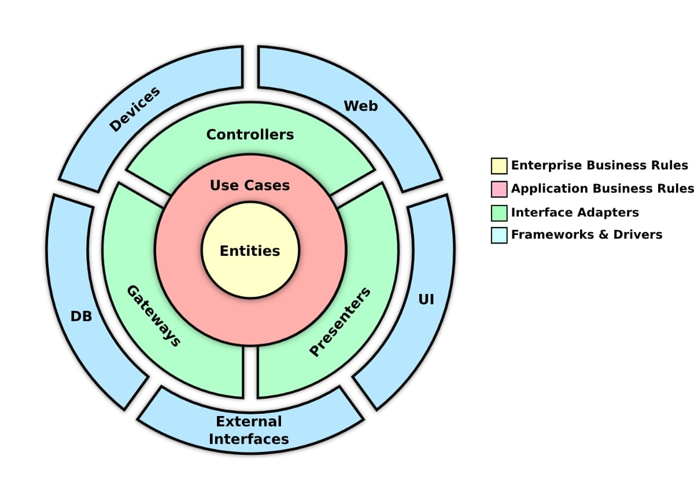
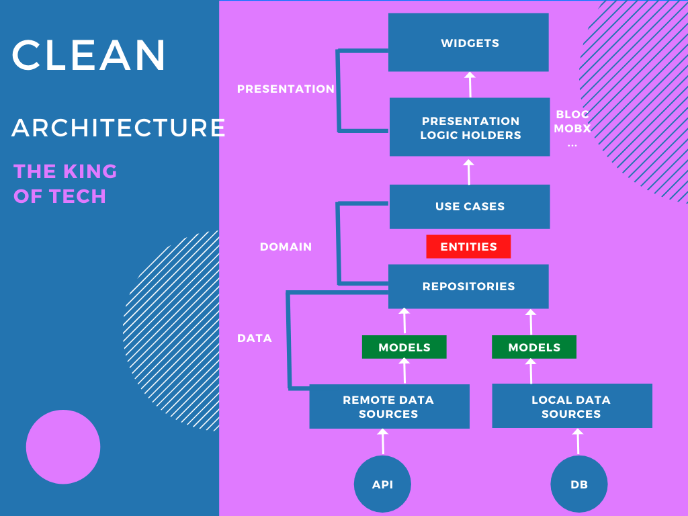
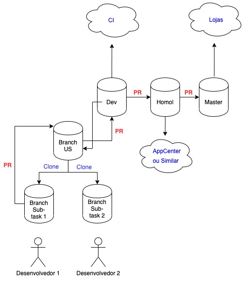

### Rodando o projeto

Entre na pasta do projeto pelo terminal e rode ```sh scripts/watch_clean.sh```

### Arquitetura

A arquitetura foi baseada no padrão Clean Architecture.




### Versionamento




### Usando o gerador de codigo
```dart run generator/main.dart -t NomeDaClasse -rt TipoDeRetorno -fn nome_da_classe```
ou
```dart run generator/main.dart --template NomeDaClasse -result-type TipoDeRetorno --folder-name nome_da_classe```

```-t``` = ```NomeDaClasse``` (nome da classe que ira ser chamada)
```-rt``` = ```TipoDeRetorno``` (bool, String, alguma model)
```-fn``` = ```nome_da_classe``` (nome da pasta onde deve ficar a classe)